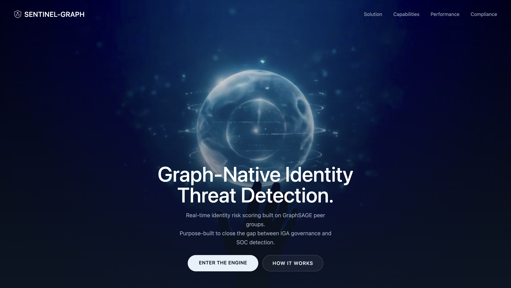
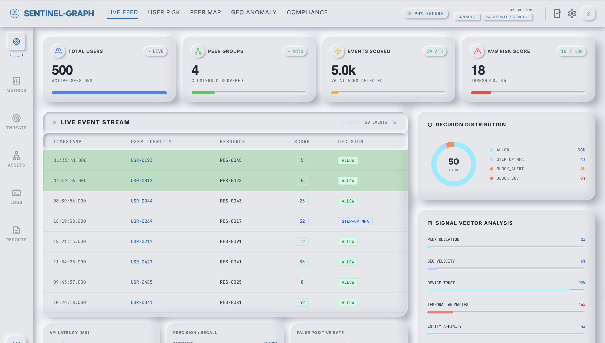
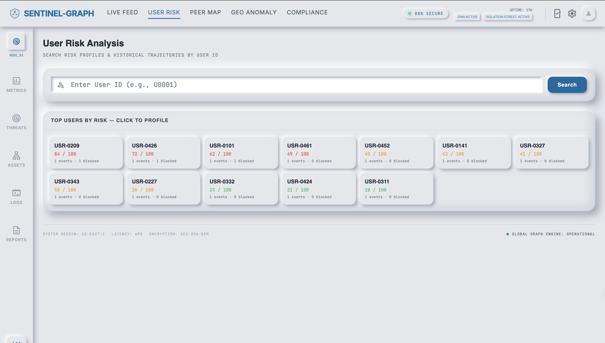
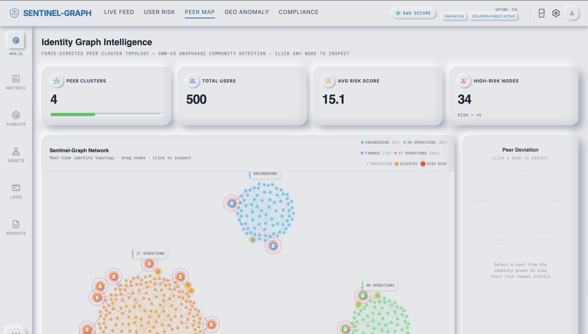
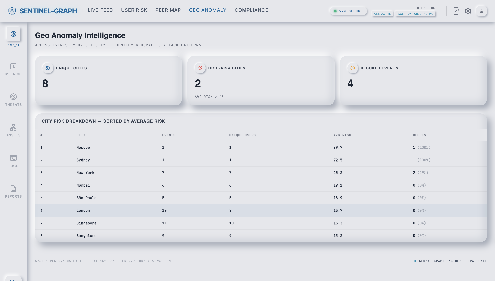
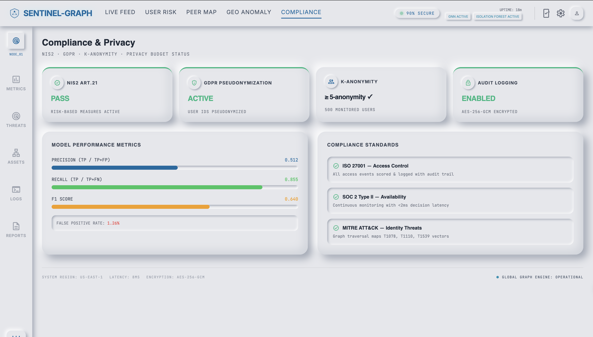

# Sentinel-Graph Engine

> **Graph-Native Identity Threat Detection — Real-time behavioral risk scoring built on GraphSAGE peer groups**

**Team Velosta · PS 11 — AI-Driven Identity Risk Scoring for Adaptive Access Control**

---

## Demo

**Live demo video:** https://www.youtube.com/watch?v=liriBJJAbUY



---

## The Problem

**68% of breaches involve compromised credentials** (Verizon DBIR 2025). The attacker has the right password, logs in from the right city, at the right time, and accesses only what the employee is allowed to. Every rule passes. Every policy clears. Your SIEM sees a normal Tuesday.

Existing tools ask: *"Is this normal for you?"*

That question fails for three reasons:
- **New employees** have no history — they get blocked or given a free pass
- **Slow-burn insider threats** gradually shift their own baseline — the system adapts with them
- **Credential theft** perfectly mimics the victim's personal history — because it is their history

---

## The Solution

Sentinel-Graph asks a different question: **"Is this normal for people like you?"**

Every user is a node in a behavioral identity graph. Every login is scored against their **functional peer group** — not their personal history. GraphSAGE embeddings + Louvain community detection automatically discover who behaves like whom, with no manual labelling and no configuration.

```
Login Event → Identity Graph → GraphSAGE Embeddings → Peer Group Scoring → Adaptive Decision
                                                                            ├── 0–30:   Allow
                                                                            ├── 31–60:  Step-Up MFA
                                                                            ├── 61–85:  Block + Alert
                                                                            └── 86–100: Block + SOC
```

**The cold start problem is solved by design.** New employees are embedded into the graph using their role, department, and permissions — they get a peer group baseline on day one, before their first login.

---

## Why Peer Groups Beat Personal History

| Scenario | Rule-Based | ML-Only | Sentinel-Graph |
|---|---|---|---|
| HR user accesses financial DB (has permission) | Allowed | Allowed | **Flagged** — no HR peer does this |
| New employee accesses team resources | Blocked — no baseline | Blocked — no data | **Allowed** — all peers do this |
| Admin slowly expands access over weeks | Allowed — baseline drifted | Allowed — gradual change | **Flagged** — other admins don't |
| Impossible travel: Mumbai → London, 2 hrs | Missed — no rule | Depends | **Flagged** — automatic geo-velocity |

---

## Live Dashboard

### Live Feed — Real-time event scoring at 500 users/session



Every event is scored in under 15ms. The engine applies all five signals simultaneously and issues an adaptive decision. The decision distribution donut shows the engine being surgical — the vast majority of legitimate events pass through without friction.

### User Risk Analysis — Full behavioral trajectory per user



Every flagged user has a complete risk timeline, event-by-event history, and signal breakdown. SOC analysts get full context the moment an alert fires — no raw log digging, no pivoting between tools.

### Peer Map — Live identity graph topology



Force-directed graph of all 500 users, clustered by behavioral similarity — not org chart, not job title. Click any node for a live radar chart of all five signals. This is what the GraphSAGE model learned: who actually behaves like whom across the entire enterprise.

### Geo Anomaly Intelligence — Geographic risk by origin city



Every access event is geolocated and ranked by average risk score. Impossible travel is fully automatic — no rules to write, no thresholds to configure.

### Compliance & Privacy



NIS2 Article 21 active. GDPR pseudonymization active. k-Anonymity (k=5) enforced. AES-256 audit logging. Mapped to ISO 27001, SOC 2 Type II, and MITRE ATT&CK identity techniques T1078, T1110, T1539.

---

## Results

| Metric | Rule-Based | ML-Only | **Sentinel-Graph** |
|---|---|---|---|
| Detection Rate (Recall) | 13.2% | 84.2% | **85.5%** |
| Precision | 100% | 20.7% | **51.2%** |
| F1 Score | 23.3% | 33.2% | **64.0%** |
| False Positive Rate | 0.0% | 5.0% | **1.3%** |
| AUC-ROC | N/A | ~0.97 | **0.993** |
| Latency per decision | N/A | ~50ms | **<15ms** |
| Cold start (new users) | No | No | **Yes** |
| Insider threat detection | No | No | **Yes** |
| Privacy compliance | No | No | **Yes** |

**0.993 AUC-ROC** — the engine almost never confuses an attack for normal behavior.
**1.3% false positive rate** — 4x lower than ML-only. At enterprise scale, that's 500 false alerts per day vs 5,000.

---

## Architecture

```
┌─────────────────────────────────────────────────┐
│  LAYER 5: DASHBOARD + LANDING PAGE              │
│  Live Feed │ Peer Map │ Compliance │ Geo Intel   │
│  Static HTML SPA served by FastAPI              │
├─────────────────────────────────────────────────┤
│  LAYER 4: REST API (FastAPI)                     │
│  /score-event │ /live-events │ /peer-groups      │
│  /metrics │ /user/{id}/risk-history              │
├─────────────────────────────────────────────────┤
│  LAYER 3: SCORING ENGINE                         │
│  Composite Risk Score (0–100)                    │
│  5 Signals: Temporal│Geo│Device│Entity│Peer      │
├─────────────────────────────────────────────────┤
│  LAYER 2: INTELLIGENCE                           │
│  GraphSAGE Embeddings → Louvain Communities      │
│  → Peer Group Deviation Scoring                  │
│  PyTorch Geometric                               │
├─────────────────────────────────────────────────┤
│  LAYER 1: DATA + PRIVACY                         │
│  Simulated IAM Logs (500 users, 50K events)      │
│  k-Anonymity (k=5) + Differential Privacy (ε=1)  │
└─────────────────────────────────────────────────┘
```

### Evidian Orbion Integration

Sentinel-Graph integrates with Atos Evidian Orbion via SCIM. Sentinel-Graph scores — Orbion enforces. The existing IGA layer does not change. We make it intelligent.

---

## Scoring Signals

| Signal | Weight | Method |
|---|---|---|
| **Peer Alignment** | 25% | Cosine distance from GraphSAGE peer group centroid |
| **Geo-Velocity** | 25% | Impossible travel detection (distance/time > 900 km/h) |
| **Temporal Anomaly** | 20% | Z-score deviation from peer group's typical login hours |
| **Device Trust** | 15% | New/unregistered device penalties |
| **Entity Affinity** | 15% | First-time resource access vs peer group norms |

---

## Privacy by Design

- **k-Anonymity (k=5):** Each record is indistinguishable from at least 4 others
- **Differential Privacy (ε=1.0):** Laplace noise injected during GNN training
- **Pseudonymization:** No PII stored or displayed anywhere in the system
- **AES-256 audit logging:** Every decision is logged and tamper-evident
- **Compliant:** GDPR, NIS2 Article 21, ISO 27001, SOC 2 Type II

---

## Quick Start

```bash
# One command
./start.sh
```

- Landing Page: http://localhost:8000
- Dashboard: http://localhost:8000/static/dashboard.html
- API Docs: http://localhost:8000/docs

```bash
# Docker
pip install -r requirements.txt
python run_pipeline.py --no-dash
docker-compose up
```

---

## Tech Stack

| Component | Technology |
|---|---|
| Graph ML | PyTorch Geometric (GraphSAGE) |
| Graph Processing | NetworkX + python-louvain |
| Anomaly Detection | scikit-learn (Isolation Forest) |
| Privacy | ε-Differential Privacy, k-Anonymity |
| API | FastAPI + Uvicorn |
| Dashboard | Static HTML SPA (Tailwind, Canvas, D3-style SVG) |
| Containerization | Docker + docker-compose |
| Language | Python 3.10+ |

---

## Project Structure

```
sentinel-graph/
├── start.sh                        # One-command startup
├── run_pipeline.py                 # Master pipeline orchestrator
├── config.yaml                     # All configurable parameters
├── requirements.txt
├── Dockerfile / docker-compose.yml
├── api/
│   ├── main.py                     # FastAPI app — 8 endpoints + static serving
│   ├── loader.py                   # Engine loader
│   ├── explanation.py              # Natural language explanation engine
│   └── peer_group_update.py        # Inductive peer group assignment
├── data/
│   ├── generate_synthetic_data.py  # 500 users, 100+ resources, 50K events
│   ├── inject_attacks.py           # 5 attack patterns
│   └── anonymizer.py               # k-anonymity + differential privacy
├── graph/
│   ├── build_graph.py              # Heterogeneous identity knowledge graph
│   └── graph_utils.py              # Edge weights, access profiles
├── models/
│   ├── graphsage_model.py          # 2-layer GraphSAGE (PyTorch Geometric)
│   ├── train_graphsage.py          # Link prediction training
│   ├── community_detection.py      # Louvain peer group discovery
│   └── anomaly_detector.py         # Isolation Forest on embeddings
├── scoring/
│   ├── peer_deviation.py           # Peer group deviation — KEY DIFFERENTIATOR
│   ├── geo_velocity.py             # Impossible travel detection
│   ├── temporal_analyzer.py        # Login time anomaly scoring
│   ├── device_trust.py             # Device fingerprint trust
│   ├── risk_scorer.py              # Composite 5-signal fusion
│   └── decision_engine.py          # Risk score → Adaptive decision
├── evaluation/
│   └── compare_approaches.py       # Rule-Based vs ML vs Sentinel-Graph
└── docs/
    ├── PROJECT_REPORT.md
    └── screenshots/
```

---

## Team Velosta
